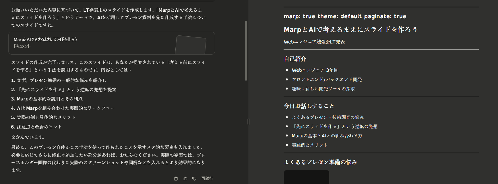

# MarpとAIで考えるまえにスライドを作ろう

---

## 今日お話しすること

- よくあるプレゼン・技術調査の悩み
- 「先にスライドを作る」という逆転の発想
- Marpの基本とAIとの組み合わせ方
- 実践例とメリット

---

## よくあるプレゼン準備の悩み


---

## 「どこから手をつけていいかわからない」問題

- 情報収集から始めるべき？
- 構成を考えるべき？
- 調査と資料作成を同時進行すると迷子になる

---

## モチベーション維持の難しさ

- 完成イメージが見えない
- 完璧主義による行動の遅れ
- 「ちゃんと理解してから資料作ろう」の罠

---

## 逆転の発想：先にスライドを作る

従来の方法：
```
調査 → 理解 → 資料作成
```

提案する方法：
```
資料作成 → 調査 → 理解・修正
```

---

## AI時代の新しいワークフロー

従来：
- 十分な知識を得てから資料作成
- 「わかってから説明する」が基本
- 調査と整理に多大な時間

AIの登場で：
- 「骨組み」を先に作れる
- 不完全な知識でもスタート可能
- 「説明しながら理解する」アプローチ

---

## この方法のメリット

1. 全体像を先に把握できる
2. 実装/調査の具体的な道筋ができる
3. モチベーション維持がしやすい
4. 「とりあえず形にする」ハードルが下がる
5. 取り組む価値/発表する価値があるか？を冷静に判断できる

---

## Marpとは何か

- **Ma**rkdown **P**resentation Ecosystem
- Markdownでスライド作成ができる
- VSCodeとの連携が簡単
- Copilotとの相性がよい

---

## Marpの魅力

- テキストベースでバージョン管理しやすい
- シンプルなMarkdown記法で作成できる
- コード表示が美しい（エンジニア発表に最適）
- HTMLやPDFへのエクスポートが容易
- CSSで見た目をカスタマイズ可能

---

## Marpの基本構文

```markdown
---
marp: true
theme: default
---

# スライド1のタイトル

コンテンツ

---

# スライド2のタイトル

- 箇条書き1
- 箇条書き2
```

---

## Marpの便利な記法

### 画像の挿入とサイズ指定

```markdown
  # 幅600pxで表示
  # 高さ400pxで表示
  # 幅と高さ両方指定
```

### 画像の位置指定

```markdown
  # 背景画像
  # 右側に33%幅で表示
```

---

## Marp使用のテクニック

### スタイル適用

```markdown
<style>
section {
  background-color: #f5f5f5;
}
h1 {
  color: #0366d6;
}
</style>
```

---

## AIとMarpの組み合わせ方

1. タイトルとおおまかな内容をAIに伝える
2. アウトラインを生成してもらう
3. アウトラインの修正・確定
4. 修正したアウトラインにもとづいてMarp形式のスライドを生成
5. 生成されたスライドを編集して画像や詳細の追加・修正

---

## 今回使用したAI：Claude 3.7 Sonnet

- **視覚的コンテンツ生成の強み**:
  - マークダウン・HTMLベースの構造化文書を美しく生成
  - SVG画像やMermaid図表の正確な作成が得意
  - フロントエンド系コード（HTML/CSS/JavaScript）の理解が優れている

- **スライド作成に適している理由**:
  - 構造と視覚的表現のバランスが取れている
  - マークダウン形式での出力が整理されている

※他のAIよりもフロントエンド寄りの特性を感じるため、
　Marpスライド作成との相性が良い気がする

---

## 実例：AIへのプロンプト例

```
「情報過多にサヨナラ！RSSHubで作る自分だけの情報収集システム」
というテーマのLT発表用のスライドをMarp形式で作ってください。
技術的な概要と実装方法を含めてください。
```

---

## AIが作ったアウトライン例（手修正なし）

```
# 「情報過多にサヨナラ！RSSHubで作る自分だけの情報収集システム」アウトライン

## はじめに (2分)
- 情報過多時代の課題：毎日大量の情報に触れる現代のエンジニア
- 効率的な情報収集の重要性
- RSSの再評価と現代的活用法

## RSSHubとは (3分)
- RSSHubの基本概念と特徴
- GitHubスター数と活発なコミュニティ
- 様々なウェブサイトをRSS化できる万能ツール

## RSSHubの主な機能 (4分)
- 対応サービス一覧（GitHub, Twitter, YouTube, Qiitaなど）
- カスタムルートの作成方法
- フィルタリングとカスタマイズ機能

## 実装デモ (5分)
- ローカル環境でのセットアップ方法
- Dockerを使った簡単なデプロイ
- 具体的な設定例とカスタマイズポイント

## RSS情報の活用方法 (4分)
- RSSリーダーとの連携（Feedly, Inoreaderなど）
- SlackやDiscordへの通知連携
- 自動化ワークフローの構築例（IFTTT, Zapier）

## まとめと実践ヒント (2分)
- 情報過多時代を生き抜くための自分専用情報収集システム構築の重要性
- RSSHubを活用した効率的な情報収集のメリット
- 明日から実践できるステップ

## Q&A・参考資料

このアウトラインは20分のLT発表に適した内容で、エンジニア向けの技術的な側面と実用的な活用方法をバランスよく含んでいます。Marpでスライドにする際は、各セクションをさらに細分化し、コード例やスクリーンショットを追加するとより理解しやすくなるでしょう。
```

---

## AIが生成したMarpスライド（手修正なし）
[情報過多にサヨナラ！RSSHubで作る自分だけの情報収集システム](./sub-slide.html)


---

## 人間による修正ポイント

- 記載内容の実証、修正、補足
- 具体例やコードの追加
- 画像の挿入
- 企業・チーム固有のコンテキスト追加
### MarkdownやMarpの記法など細かい部分の修正はCopilotを便利につかう

---

## 実践的なワークフロー

1. アイデアが浮かんだらすぐAIでスライド化
2. 生成されたスライドを保存（GitやNotion等）
3. 時間があるときに調査・実装
4. スライドを修正しながら理解を深める
5. 発表準備完了！

---

## この方法の実践的なメリット

- 「あとでやろう」が減る
- アイデアを逃さない
- 他の人に説明しやすくなる
- あとで見返したときに自分でもわかりやすい
- 知識の整理・蓄積がしやすくなる

---

## 注意点と改善のヒント

- AIの出力は必ず検証する
- 技術的な正確性は自分で担保する
- Marpのテンプレートをカスタマイズしておくと効率的
- AIプロンプトの工夫が重要

---

## AIプロンプトの工夫例

- 対象者や技術レベルを明記する
- 具体的なセクション構成を指示する
- コード例や図解の挿入を依頼する
- 発表時間の目安を伝える

---

## まとめ：考える前にスライドを作ろう

1. アイデア → AIでスライド生成 → 保存
2. 調査・実装 → スライド修正
3. 発表準備完了

手を動かす前の「思考の足場」としてのスライド作成

---

## この発表自体もこの方法で作りました



---

## ご清聴ありがとうございました

質問・感想などあればお気軽に！
